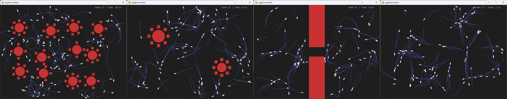

# Performance Analysis of the Boids Algorithm in Coverage Scenarios

Repository containing code for the final project of course MEAM6240: Distributed Robotics, taken during the Spring 2025 semester at the University of Pennsylvania.

**Description:** 
We implement and analyze the boids model for flocking behavior, with a focus on optimizing its effectiveness for coverage tasks through systematic tuning of key behavioral parameters. By adjusting the core gains that govern alignment, cohesion, and separation, the same underlying framework can yield a wide spectrum of emergent group dynamics, ranging from tight, cohesive flocking to deliberate spatial dispersion. The implementation explores the practical applications of these behaviors for distributed robotics systems, with quantitative analysis of exploration across various parameter configurations and environmental scenarios.

**Sample Figures:** 
Here's a screenshot of the interactive simulator:

Here's a screenshot of the boids, tuned to optimal coverage, scurrying around three tested maps:
